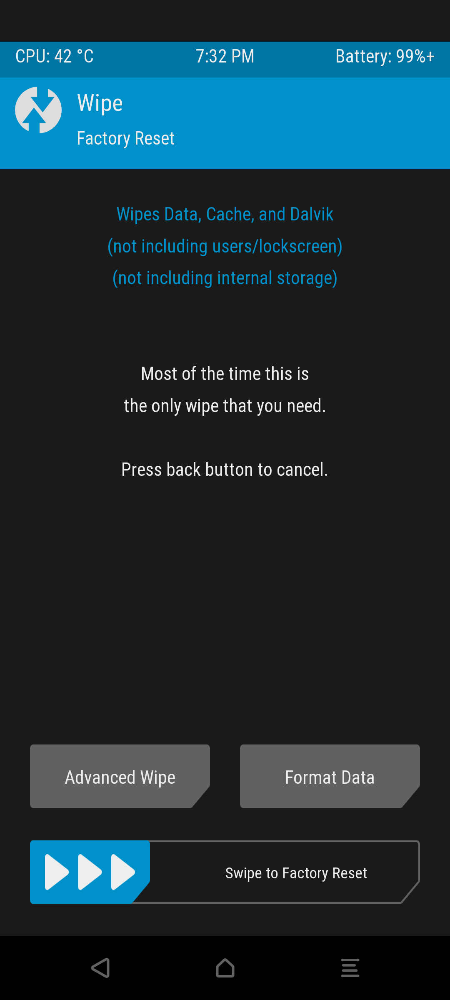
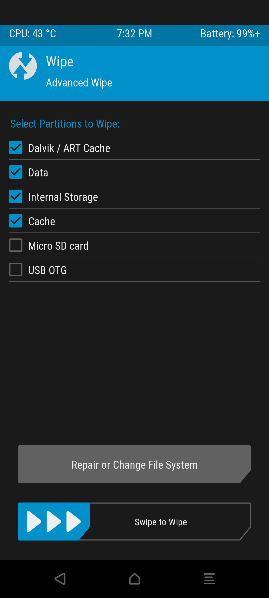
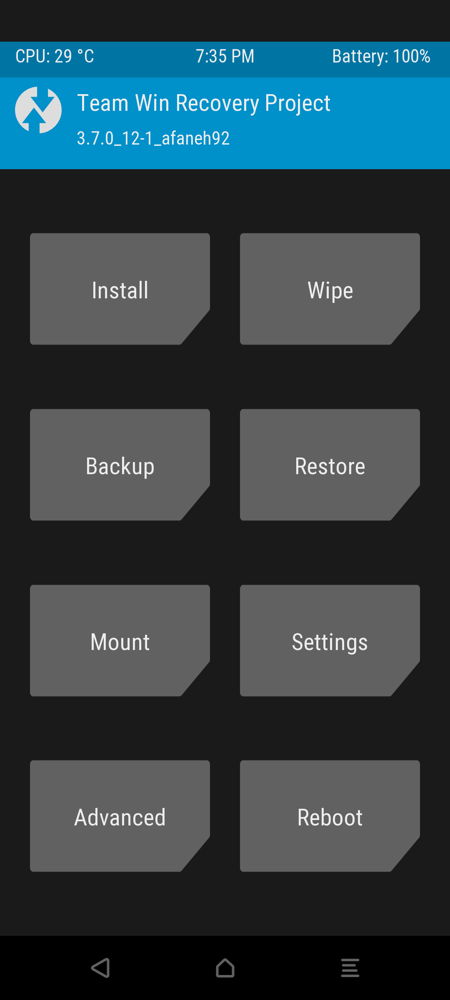
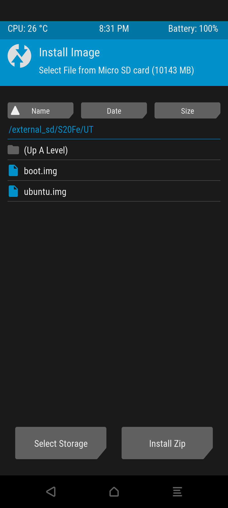
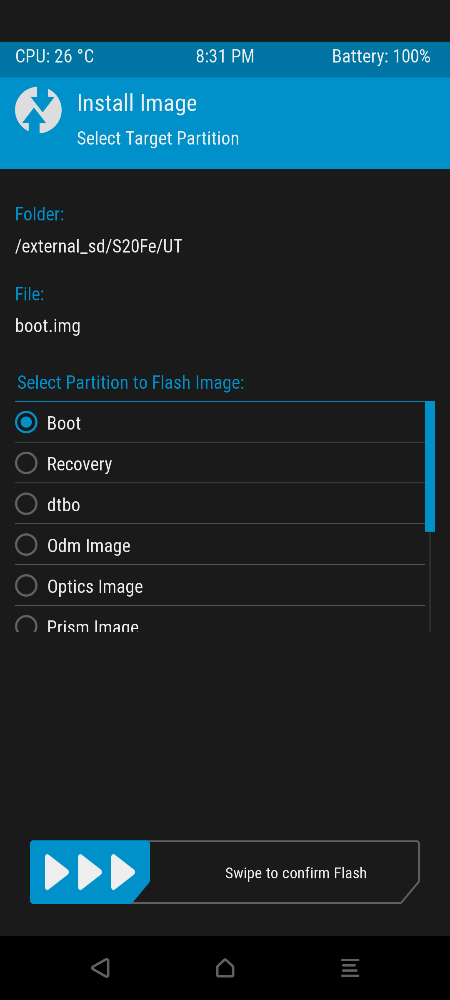
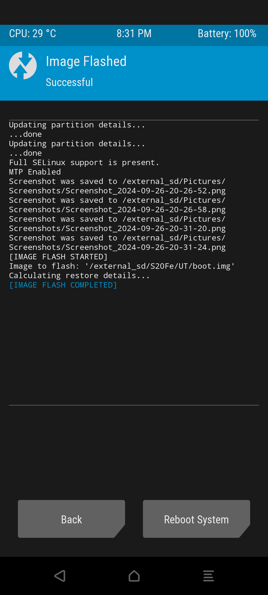
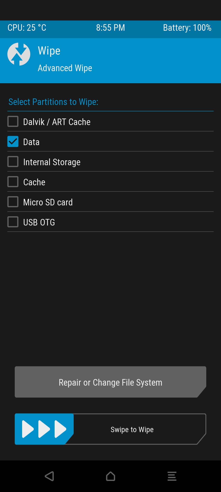
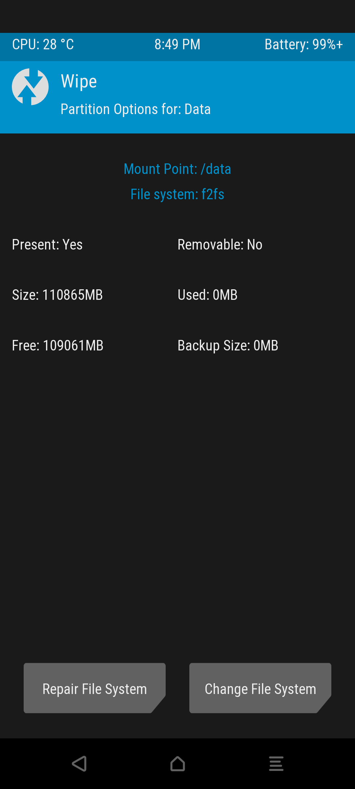

# Installation

*For installation you have to review [Requirements for installation](https://github.com/Sota4Ever/samsung-S20FE/blob/halium-13-r8s/Requirements-for-installation.md)*

### Put the device in Odin mode (Download)
It is similar to disabling vbmeta in exchange for only replacing the recovery image, but in device method you only have to change

```
heimdall flash --RECOVERY /path/to/recovery.img
```

Replace "/path/to/" with the actual folder location of your recovery.img file.

### Put the device in recovery mode
Press VOLUMEN UP + POWER BUTTON with the cable connected to a device

- ### Format the following partitions
<div style="display: flex; justify-content: flex-start; align-items: center;">
    
    
    
    
</div>

- ### Flash the boot image (boot.img)
<div style="display: flex; justify-content: flex-start; align-items: center; margin-bottom: 10px;">
    
    
    
    
</div>

### Put ext4 format on the /data partition
<div style="display: flex; justify-content: flex-start; align-items: center; margin-bottom: 10px;">
    
    
    
    
    
    
</div>

*Swipe to change*

### Copy the ubuntu.img image to the /data partition

Lots of images, I'll just say quickly.

- At the beginning go to `Advanced` and in options there it says `Terminal`
 - Copy the ubuntu.img image to the /data partition
 ```
 cp -r ubuntu.img /data
 ```
 When you finish copying the image, it's done.

______________________
 # You finished and now restart the device and enjoy Ubuntu Touch :D
